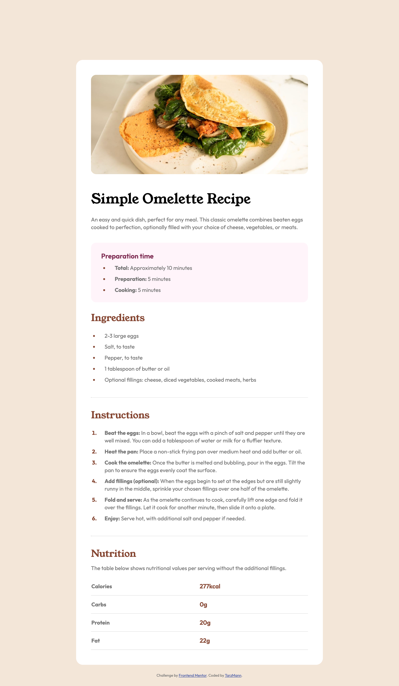

# Frontend Mentor - Recipe page solution

This is a solution to the [Recipe page challenge on Frontend Mentor](https://www.frontendmentor.io/challenges/recipe-page-KiTsR8QQKm). Frontend Mentor challenges help you improve your coding skills by building realistic projects. 

## Table of contents

- [Overview](#overview)
  - [The challenge](#the-challenge)
  - [Screenshot](#screenshot)
  - [Links](#links)
- [My process](#my-process)
  - [Built with](#built-with)
  - [What I learned](#what-i-learned)
  - [Continued development](#continued-development)
  - [Useful resources](#useful-resources)
- [Author](#author)
- [Acknowledgments](#acknowledgments)

## Overview

### Screenshot

### Links

- Solution URL: (https://github.com/TarzMann/recipe-page-main)
- Live Site URL: (https://tarzmann.github.io/recipe-page-main/)

## My process

I started setting out the html and content and then moved on to setting the styles with CSS.

### Built with

- Semantic HTML5 markup
- CSS custom properties

### What I learned

I used this exercise to refresh my memory on basic HTML and CSS.

I did a lot more learning about mobile first and responsive website design.

My main learning was how to adjust default list items (ordered and unordered).

### Continued development

I realise that I didn't quite set this site up as mobile first, but I will do so for future projects.

I will continue to try and use more complex responsive design using varying column widths for various media types.

I struggled to get a smooth transition of the image at the top of the page from margin to no margin on smaller devices, so I would like to look into this further. Very interested to see other examples to see if anyone managed to find a good solution for this.

I am also still aware that I may not quite understand the cascading nature of stylesheets in-depth yet. Like, should I put all my standard html css changes in first then move onto all the classes... and where is the best place to put the @media query? I put it at the end, but am re-thinkig this may be better at the start.

### Useful resources

- [CSS Responsive section on W3Schools](using https://W3Schools.com) - This helped me to understand some simple and effective basic responsive styling (from scratch).

## Author

- Website - [TarzMann](https://github.com/TarzMann)
- Frontend Mentor - [@TarzMann](https://www.frontendmentor.io/profile/TarzMann)

## Acknowledgments

Mainly thanks to W3Schools where all my info came from for this one!
